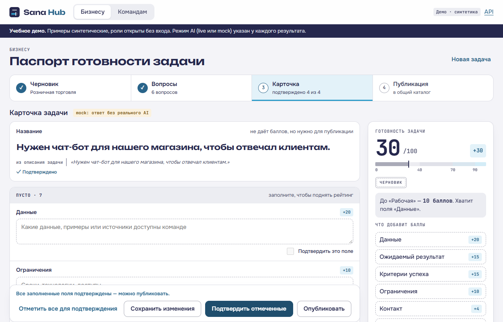
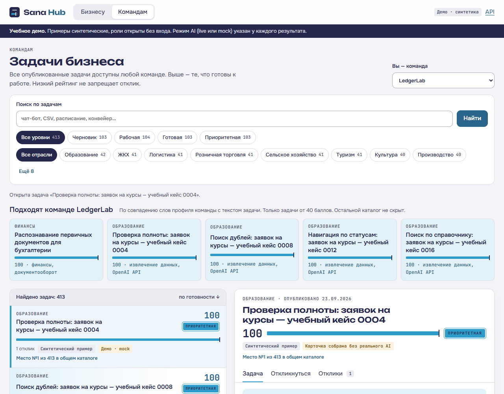
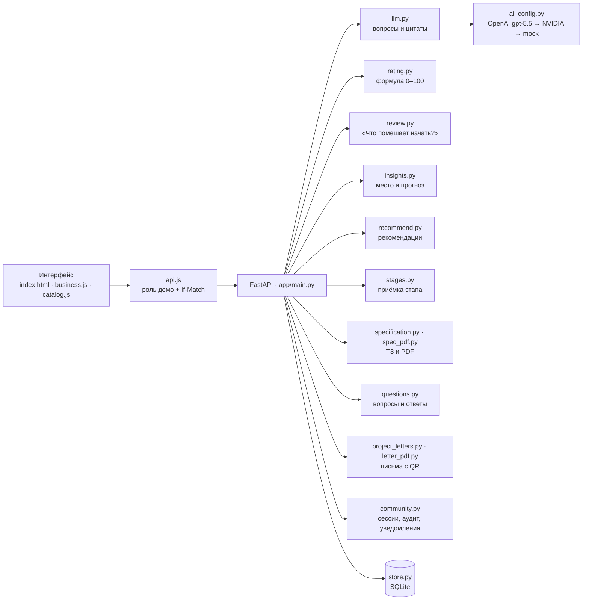

# Sana Hub — паспорт готовности бизнес-задачи

**HackAlem AI · трек 07 «Образование» · кейс AI Sana Challenge Hub**

Бизнес описывает задачу в одну строку. Sana Hub задаёт уточняющие вопросы, собирает карточку с цитатами из ответов и считает рейтинг готовности 0–100. Опубликованная задача попадает в общий каталог, студенческие команды сами откликаются, а бизнес вручную выбирает, с кем работать. После проекта участники получают проверяемое рекомендательное письмо с QR-кодом.

**Демо:** https://sana-hub-0ca1dc1.onrender.com/ · **API:** [/docs](https://sana-hub-0ca1dc1.onrender.com/docs) · вход не нужен, роли демонстрационные, данные синтетические. Модель — OpenAI `gpt-5.5`.



---

## Содержание

1. [Проверка за пять минут](#проверка-за-пять-минут)
2. [Соответствие кейсу](#соответствие-кейсу)
3. [Рейтинг готовности](#рейтинг-готовности)
4. [Правила каталога](#правила-каталога)
5. [Как используется AI](#как-используется-ai)
6. [Дополнительно к MVP](#дополнительно-к-mvp)
7. [Архитектура](#архитектура)
8. [Запуск](#запуск)
9. [Тестовые сценарии](#тестовые-сценарии)
10. [Данные](#данные)
11. [Статус проверки и ограничения](#статус-проверки-и-ограничения)

---

## Проверка за пять минут

Сценарий повторяет обязательную демонстрацию из п. 11 кейса. Всё происходит в интерфейсе, без слайдов.

| # | Где | Что сделать | Что должно получиться |
|---|---|---|---|
| 1 | «Бизнесу» | Ввести «Нужен чат-бот для нашего магазина, чтобы отвечал клиентам», отрасль «Розничная торговля», нажать «Уточнить задачу» | Не меньше трёх уточняющих вопросов, у каждого указано поле карточки |
| 2 | Вопросы | Ответить на 2–3 вопроса, «Собрать карточку» | Карточка с цитатами-источниками. Рейтинг **0**: AI не подтверждает факты сам |
| 3 | Карточка | «Отметить все» → «Подтвердить отмеченные» | Рейтинг растёт. На пустых полях видно, сколько баллов они дадут |
| 4 | Карточка | Заполнить «Данные», подтвердить | **+20**, уровень меняется, панель пишет, сколько осталось до следующего |
| 5 | Карточка | «Опубликовать» | Карточка открывается в каталоге на своей позиции |
| 6 | «Командам» | Вкладка «Откликнуться»: команда, идея, план, срок, ссылка | Отклик появился во вкладке «Отклики» |
| 7 | «Отклики» | «Выбрать» или «Отклонить» | Решение ручное. Можно выбрать несколько команд или ни одной |
| 8 | «Отклики» | «Подтвердить этап» | +10 баллов прогресса команде, повторно не начисляются |

Подробный сценарий с репликами: [docs/DEMO_SCRIPT.md](docs/DEMO_SCRIPT.md).

## Соответствие кейсу

| Требование кейса | Как реализовано |
|---|---|
| Свободный ввод, проверка полноты, ≥ 3 вопроса | Вопросы генерирует AI по недостающим полям; при сбое — явно помеченный mock |
| Редактируемая карточка, ручное подтверждение | Подтверждается точное значение поля. Любая правка снимает подтверждение |
| Все поля карточки из п. 3 | Название, контекст, потребность, пользователи, данные, ограничения, результат, критерии успеха, контакт, формат, обратная связь |
| Рейтинг 0–100, расшифровка, недостающие сведения, пересчёт | Считает код, не модель. Показаны баллы по критериям и «+N» за каждое пустое поле |
| Общий каталог, сортировка по рейтингу, фильтры | Поиск, фильтры по отрасли и уровню, страницы по 20 задач |
| Отклики без ограничения числа | Любая команда, любое число откликов, даже на черновик |
| Ручной выбор бизнеса | Только кнопки бизнеса. Автоматического назначения нет |
| Баллы за подтверждённый этап | +10 один раз на пару «задача — команда», в одной транзакции |
| AI не добавляет фактов | Каждое поле, собранное AI, — дословная цитата из ввода бизнеса. Проверка R-QUOTE отклоняет выдуманные цитаты |
| Рекомендации не ограничивают каталог | Отдельный блок «Подходят команде», общий каталог остаётся виден целиком |
| Синтетические данные, минимум по 5 записей | 413 черновиков и карточек, 10 команд, 417 откликов |

Официальный текст кейса: [docs/CASE.md](docs/CASE.md), [PDF](docs/CASE-official.pdf).

## Рейтинг готовности

Формула из п. 4 кейса, реализация — [app/rating.py](app/rating.py). Баллы дают только поля, подтверждённые человеком.

| Критерий | Баллы | Поля карточки |
|---|---:|---|
| Контекст и потребность | 20 | `context` 10 + `need` 10 |
| Данные и материалы | 20 | `data` |
| Ожидаемый результат | 15 | `expected_result` |
| Критерии успеха | 15 | `success_criteria` |
| Ограничения | 10 | `constraints` |
| Пользователи | 10 | `users` |
| Связь с бизнесом | 10 | `contact` 4 + `interaction_format` 3 + `feedback_process` 3 |

| Уровень | Баллы | В каталоге |
|---|---|---|
| Черновик | 0–39 | виден, помечен «Нужны уточнения», отклики принимаются |
| Рабочая | 40–69 | можно рекомендовать командам |
| Готовая | 70–89 | выше в списке |
| Приоритетная | 90–100 | выделена цветом и штампом |

**Правила:**
- Подтверждение привязано к точному тексту поля: изменили текст — баллы за поле снимаются до нового подтверждения.
- Название баллов не даёт, но без него карточку нельзя опубликовать.
- Сервер возвращает вместе с рейтингом список недостающих полей с баллами и расстояние до следующего уровня. Экран ничего не считает сам.
- Разделение весов внутри блоков «Контекст и потребность» и «Связь с бизнесом» выбрала команда: в кейсе задан только общий вес блока.

## Правила каталога

- В каталоге **все** опубликованные задачи. Низкий рейтинг не скрывает задачу и не запрещает отклик.
- Порядок: рейтинг по убыванию, при равенстве — раньше опубликованная выше. Порядок задаёт сервер.
- Фильтры: текстовый поиск, отрасль, уровень готовности. У каждого фильтра видно число задач.
- Команды видят **опубликованный снимок** карточки. Неопубликованные правки бизнеса в каталог не попадают. Отклик сохраняет условия, на которые команда откликнулась.
- Рекомендации — только задачи от 40 баллов, отобранные по совпадению слов профиля команды (интересы, навыки, технологии) с текстом задачи. Основания совпадения показаны. Это эвристика, не AI-подбор. Команды система не ранжирует и не назначает.
- У каждой карточки показано её место в общем каталоге.



## Как используется AI

**Принцип: модель объясняет и спрашивает, код считает и проверяет.**

| Функция | Вход | Выход | Что проверяет код |
|---|---|---|---|
| Уточнение и сборка карточки | Текст черновика и ответы бизнеса | Цитаты по полям + ≥ 3 вопроса (Structured Outputs) | R-QUOTE: источник существует, цитата дословная, одно поле — одна цитата; вопросов ≥ 3 и они разные |
| «Что помешает начать?» | Сохранённые поля карточки | До трёх замечаний: цитата, проблема, вопрос | Цитаты дословные; пустые поля и отложенные ответы находят правила, без AI |
| ТЗ для студентов (необязательно) | Подтверждённые поля карточки | Разделы ТЗ и дополнительные идеи | Идеи не выбираются автоматически; утверждает и публикует бизнес |
| Второе мнение NVIDIA | Те же поля карточки, без ответа первой модели | Независимые замечания, хранятся отдельно | Цитаты дословные; баллы и подтверждения не меняются |
| Перенос ответа в карточку | Вопрос студента и ответ бизнеса | Подходящее поле карточки | Переносится дословный ответ; поле теряет подтверждение, публикует только бизнес |

- **Модель:** OpenAI `gpt-5.5` через Responses API со Structured Outputs, `OPENAI_REASONING_EFFORT=low`. [Официальная документация модели](https://developers.openai.com/api/docs/models/gpt-5.5).
- **Порядок провайдеров при сбое:** OpenAI → NVIDIA (резерв, не проверен) → явно помеченный mock, если `FALLBACK_TO_MOCK=1`. Если `FALLBACK_TO_MOCK=0`, пользователь получает ошибку 503, карточка остаётся нетронутой, запрос можно повторить.
- **Режим видно у каждого результата:** `live · openai`, `live · nvidia` или `mock`. В проверке карточки также показана модель.
- **Второе мнение NVIDIA:** отдельная кнопка на экране бизнеса. Получает только поля карточки, сохраняет независимый результат и не меняет баллы/подтверждения. В live без ключа возвращает понятную ошибку; скрытой замены на OpenAI/mock нет. Для обычных AI-функций NVIDIA остаётся резервом. Ключ сейчас отсутствует, реальный NVIDIA-вызов не проверен. [NVIDIA API](https://docs.api.nvidia.com/nim/reference/meta-llama-3_3-70b-instruct-infer).
- **Без AI:** рекомендательные письма собираются из версионируемых шаблонных фраз, API отвечает `ai_used: false`. Поиск похожих вопросов и рекомендации задач — сравнение слов.
- **Промпт, схема ответа и R-QUOTE:** [app/llm.py](app/llm.py). Модели и провайдеры: [app/ai_config.py](app/ai_config.py).
- **Защита от лишних трат:** суммарный вход до 30 000 символов, лимит `MAX_CALLS_PER_HOUR`, таймаут `AI_TIMEOUT_SECONDS`. Логи `logs/llm_calls.jsonl` содержат только метаданные, без текста и ключей.
- **Чего AI не делает:** не подтверждает поля, не ставит баллы, не выбирает и не ранжирует команды, не использует персональные признаки.

## Дополнительно к MVP

| Функция | Что даёт | Статус |
|---|---|---|
| **«Что помешает начать?»** | Проверка сохранённой карточки: замечания с цитатой и вопросом, кнопка «Уточнить поле» ведёт к редактору. Правка помечает анализ устаревшим. Рейтинг и подтверждения проверка не меняет | На Render |
| **Рост позиции** | До трёх вариантов «если дополнить поле X — будет N баллов и место M». Считает сервер по текущему каталогу. Это условный расчёт, не обещание откликов | На Render |
| **Приёмка этапа** | Бизнес фиксирует условия этапа, команда сдаёт ссылку, бизнес принимает или возвращает на доработку с причиной; +10 один раз | На Render; браузерный сценарий пройден локально |
| **Продолжение после F5** | Можно открыть последнюю сохранённую карточку. В браузере хранится только её ID | На Render; браузерный сценарий пройден локально |
| **ТЗ для студентов в PDF** | Бизнес включает, генерирует, правит и утверждает ТЗ; студенты видят утверждённую версию и скачивают PDF с кириллицей. По умолчанию выключено | На Render; сценарий пройден локально в mock, отдельный запрос GPT-5.5 на синтетике прошёл. [Подробно](docs/TECHNICAL-SPEC.md) |
| **Второе мнение NVIDIA** | Отдельная проверка тех же исходных полей без ответа первой модели; результат хранится отдельно | На Render; без ключа NVIDIA показывает понятную ошибку. Проверено в mock |
| **Вопросы по карточке** | Студент задаёт публичный вопрос (не больше 5 в сутки на карточку) и видит похожие. Бизнес отвечает, правки сохраняют историю, ответ можно перенести в поле карточки. Модерация, подписка, уведомления внутри приложения | На Render; тесты и браузерный сценарий пройдены локально |
| **Рекомендательное письмо** | После проекта капитан задаёт роли, участники их подтверждают, бизнес заполняет опросник. Каждый участник получает личный PDF с QR-проверкой; есть перевыпуск, отзыв и жалоба на факты. Письмо на русском, казахском или английском | На Render; тесты и браузерный сценарий пройдены локально. [Подробно](docs/COMMUNITY.md) |
| **Казахский язык** | Экраны вопросов и писем на русском и казахском | На Render |

## Архитектура

Один процесс FastAPI отдаёт API и статический интерфейс без сборки. Данные — SQLite, каждая запись в отдельной транзакции.



| Решение | Зачем |
|---|---|
| `If-Match` с ревизией карточки | Правка из устаревшего окна получает 409 и не затирает чужие изменения |
| Опубликованный снимок | Команды откликаются на зафиксированные условия |
| Уникальная запись этапа | +10 не начисляются дважды даже при одновременных запросах |
| Баллы готовности и прогресса раздельно | Рейтинг задачи и прогресс команды не смешиваются |
| Выданный PDF письма не меняется | Исправление — новая версия, старая получает статус «заменено»; хранится SHA-256 |

**Стек:** Python 3.10+ (Docker — 3.12), FastAPI, Pydantic v2, SQLite, OpenAI SDK, ReportLab, чистый JavaScript без Node. QR-ссылки строятся от `APP_PUBLIC_URL`, а не от заголовка запроса. Точные версии — [requirements.txt](requirements.txt). Подробнее — [docs/ARCHITECTURE.md](docs/ARCHITECTURE.md).

## Запуск

Нужны Git и Python 3.10+. Ключи для запуска не нужны: по умолчанию `MOCK=1`.

```powershell
git clone https://github.com/BAITC-Hacks/hack-a2928c88-hackai.git
cd hack-a2928c88-hackai
python -m venv .venv
.\.venv\Scripts\python.exe -m pip install -r requirements-dev.txt
Copy-Item .env.example .env   # только при первом запуске
.\.venv\Scripts\python.exe -m uvicorn app.main:app --host 127.0.0.1 --port 8000
```

Открыть http://127.0.0.1:8000 и http://127.0.0.1:8000/docs. В Linux и macOS те же команды, только `./.venv/bin/python` и `cp .env.example .env`.

**Docker:**

```bash
docker build -t sana-hub .
docker run --rm -p 8000:8000 -v sana-data:/data -e MOCK=1 sana-hub
```

<details>
<summary><b>Реальный OpenAI, база данных, роли в API</b></summary>

- **Реальный AI.** В локальном `.env` задайте `OPENAI_API_KEY`, `OPENAI_MODEL=gpt-5.5`, `MOCK=0` и перезапустите сервер. Проверка одним платным запросом на синтетике: `python scripts/check_ai.py`. Ключ в вывод не попадает. На Render эти значения задаются в Environment отдельно.
- **База.** `data/runtime/sana.sqlite3` сохраняется между запусками. При старте добавляются только недостающие демо-записи, существующие данные и решения не перезаписываются. Для чистой базы задайте другой `DATABASE_PATH`. `SEED_DEMO=0` отключает импорт примеров. В контейнере подключайте постоянный том к `/data`.
- **Вопросы и письма.** `COMMUNITY_DEMO=1` включает выбор учебного пользователя (заказчик, модератор, капитан и участник каждой команды) без пароля. `APP_PUBLIC_URL` — адрес сайта для QR-ссылок: он должен совпадать с адресом, который увидят получатели. Подробно — [docs/COMMUNITY.md](docs/COMMUNITY.md).
- **Роли в `/docs`.** Действия бизнеса требуют заголовка `X-Demo-Role: business`, отклик — `team`. Правка, подтверждение и публикация требуют `If-Match` с `revision` карточки. `api.js` передаёт это сам. Это роли для демо, а не аутентификация.

</details>

## Тестовые сценарии

```powershell
.\.venv\Scripts\python.exe -m pytest -q      # 156 passed
```

Автотесты покрывают: черновик → вопросы → карточку с нулём баллов → подтверждение → публикацию → правку со снятием подтверждения; низкий рейтинг и отклик на него; ручной выбор нескольких команд; однократные +10 при одновременных запросах; конфликты версий; R-QUOTE; поиск, страницы и фильтры каталога; рекомендации; устаревание анализа; цикл приёмки этапа; ТЗ и PDF с кириллицей; второе мнение NVIDIA и ошибку без ключа; права на вопросы и ответы, лимит вопросов при одновременных запросах; письма: роли, опросник, неизменность PDF, статусы QR-проверки, сроки уведомлений; сохранение базы после перезапуска.

**Браузерные сценарии** (Playwright и Edge: `pip install playwright==1.63.0`, запускать на отдельной учебной базе с `MOCK=1`):

| Скрипт | Что проверяет |
|---|---|
| `scripts/smoke_e2e.py --url http://127.0.0.1:8000 --mode mock` | Весь путь из п. 11: рейтинг 0 → 100 → 80 → 100, публикация, отклик, ручной выбор, +10 без повтора, понятная ошибка при HTTP 503 |
| `scripts/smoke_catalog.py --url http://127.0.0.1:8000` | Фильтр черновиков, отклик на задачу с низким рейтингом, обязательная ссылка, выбор, этап |
| `scripts/smoke_review.py --url http://127.0.0.1:8000` | F5 → замечание → переход к полю → правка → устаревание → повтор → опубликованный анализ и место |
| `scripts/smoke_stages.py --url http://127.0.0.1:8000` | Условия этапа → сдача → доработка → повторная сдача → приёмка → F5 → нет повторных баллов |
| `scripts/smoke_nvidia_review.py` | Второе мнение отдельно от основной проверки, понятная ошибка без ключа |
| `scripts/smoke_questions.py --url http://127.0.0.1:8000` | Вопрос → ответ владельца → правка с историей → перенос в карточку с повторным подтверждением → дубликат → уведомления → казахский и телефон |
| `scripts/smoke_project_letters.py --url http://127.0.0.1:8009 --serve-isolated` | Роли → опросник → выдача → PDF → все статусы QR-проверки → жалоба → согласие на публикацию. Сам поднимает отдельный сервер |

Ручная приёмка: [16 сценариев для тестировщика](docs/TESTER-SCENARIOS.md). Скрипты создают учебные записи. Запуск против публичного сайта требует явного флага `--allow-remote`. `--mode live` делает два платных запроса к AI.

**Формула в одну команду:**

```powershell
.\.venv\Scripts\python.exe -c "from app.schemas import TaskCard; from app.rating import calculate_rating, confirm_fields, edit_card; c = TaskCard(draft_id='demo', industry='retail', context='Requests by email', data='Synthetic CSV', synthetic=True); print(calculate_rating(c).total); c = confirm_fields(c, ['context', 'data'], business_actor='demo-business'); print(calculate_rating(c).total); c = edit_card(c, {'context':'Requests by phone'}); print(calculate_rating(c).total)"
```

Результат **0 → 30 → 20**: заполненное поле без подтверждения баллов не даёт, подтверждение добавляет баллы, правка снимает баллы изменённого поля.

**Проверка качества AI-замечаний:** `python scripts/eval_review.py --live` делает 12 платных запросов. Из 12 ответов 11 реальных и один fallback, ожидаемые поля совпали в 9 случаях из 12 ([отчёт](docs/EVAL-REVIEW.md), [первый прогон](docs/EVAL-REVIEW-BASELINE.md)). Это диагностический набор для настройки, а не метрика точности. Прогон сделан на прежней модели `gpt-4.1-mini`, на GPT-5.5 его результаты не переносятся.

## Данные

[data/samples/ai-sana-synthetic.json](data/samples/ai-sana-synthetic.json): 413 черновиков, 413 карточек, 10 команд, 417 откликов. У каждой записи пометка `synthetic: true`.

- **13 ручных кейсов** из разных отраслей: промышленность, ЖКХ, финансы, туризм, транспорт и другие. Их баллы специально стоят на границах уровней: 24, 37, 69/70, 97.
- **400 шаблонных сценариев:** 10 отраслей × 10 рабочих процессов × 4 степени полноты. Баллы 20/50/75/100 означают полноту описания, а не качество решения.
- **Все организации, контакты и команды вымышлены.** Ссылки на `example.com` никуда не ведут. Упомянутые в задачах CSV не приложены.
- **Карточки — учебные эталоны** с подтверждениями автора набора, а не автоматически подтверждённый вывод AI.
- **Источники и сборка:** [coord/notes/Q-132813-claude.md](coord/notes/Q-132813-claude.md), [synthetic-extra-source.json](data/samples/synthetic-extra-source.json), [generate_synthetic_bulk.py](scripts/generate_synthetic_bulk.py). Пересчёт баллов: `python scripts/prepare_demo_data.py`.

## Статус проверки и ограничения

| Что | Статус на 23.09.2026 |
|---|---|
| Версия на Render | Образ `docker.io/denryyyyyyy/sana-hub:930961031024`: всё описанное в README, включая вопросы, письма и второе мнение NVIDIA. `/health` показывает `openai_model: gpt-5.5`, `/openapi.json` — 65 эндпоинтов. Проверено 23.09.2026 |
| Полный сценарий на публичном сайте | Пройден в Edge с реальным OpenAI на предыдущей версии: 0/100/80/100, публикация, отклик, ручной выбор, +10 один раз. На текущей версии с GPT-5.5 целиком не прогонялся |
| GPT-5.5 | Реальные локальные запросы на синтетике прошли для вопросов и цитат, проверки карточки и ТЗ |
| NVIDIA | Код и mock проверены. Ключа нет (`nvidia_configured: false`), кнопка второго мнения в live показывает понятную ошибку |
| Текущая версия локально | 156 тестов; браузерные сценарии `smoke_e2e`, `smoke_questions`, `smoke_project_letters` пройдены |
| QR в письмах | Ссылка строится от `APP_PUBLIC_URL`; на Render он должен быть `https://sana-hub-0ca1dc1.onrender.com` |
| Постоянный диск на Render и доступность весь период судейства | Не подтверждены. Данные на публичном сайте считайте временными; QR-проверка писем требует постоянной базы |

**Ограничения, которые мы знаем:**
- Рейтинг измеряет полноту подтверждённого описания, а не его правдивость или качество.
- Совпадение цитаты не доказывает, что поле заполнено по смыслу. Результат проверяет человек. Mock переносит текст ответов в поля, но не разбирает его.
- Роли открыты для демо: нет аутентификации и изоляции компаний. В разделе вопросов и писем серверные сессии и проверки прав настоящие, но выбрать можно любого учебного пользователя, включая модератора. Используйте только учебные данные.
- Письмо — учебный документ: нет проверки личности подписанта и электронной подписи.
- Уведомления только внутри приложения, без email и мессенджеров.
- SQLite и лимит вызовов рассчитаны на один процесс.
- Нет загрузки файлов, чата, календаря и полного трекера. У проекта один проверяемый этап. Ввод — только текст.
- Рекомендации задач и поиск похожих вопросов сравнивают слова, а не смысл.

## Команда и раскрытие

- Использованные библиотеки, модели, шрифты, данные и заготовки перечислены в [docs/DISCLOSURE.md](docs/DISCLOSURE.md).
- Ход работы по часам: [docs/PROGRESS.md](docs/PROGRESS.md).
- Вклад Codex: [docs/CODEX_LOG.md](docs/CODEX_LOG.md).
- Codex и Claude использовались как инструменты разработки. Продуктовая AI-функция — только описанная выше.
- Деплой и обновление образа: [docs/DEPLOY.md](docs/DEPLOY.md).
- Репозиторий: [BAITC-Hacks/hack-a2928c88-hackai](https://github.com/BAITC-Hacks/hack-a2928c88-hackai).
